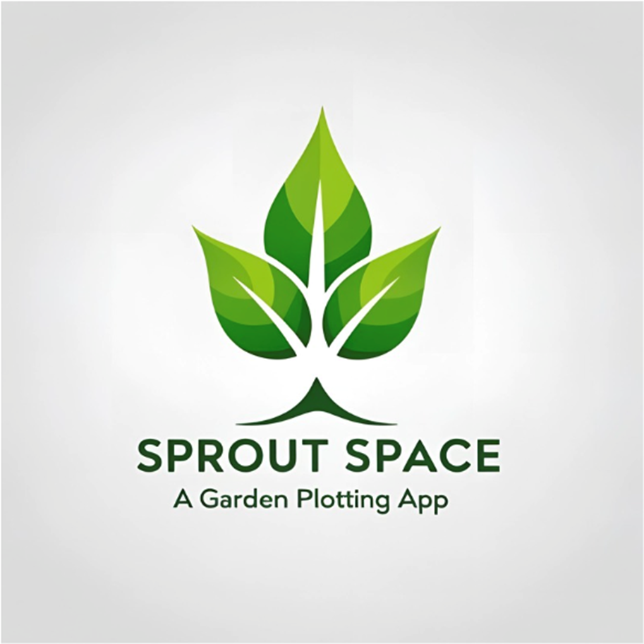

# **Sprout Space**

## 📜 **Overview/Description**
Sprout Space is a gardening app that simplifies garden design using the popular square foot gardening method. By dividing your plot into one (1) square foot squares, you can plant according to the ideal spacing needs of each vegetable, fruit, or herb. Choose your garden size, pick your plants from a database of detailed plant profiles, and watch as your plot fills with customized planting cards, complete with planting instructions, harvest timelines, and more!
##  🏃 **To run the application, click the link below:**
🔗 **Live Application**: [Render Deploy Link](https://rendertest-v95r.onrender.com/)

## 🚀 Features
- **Interactive Garden Size Selections**: Choose from a variety of garden plots, from a database of detailed plant profiles.
- **Streamlined targeted info**: Sprout SPace offers a built-in tool to search for plant & pest information through a comprehensive API.
- **Responsive User Interface**: Explore the interactive custom plot designs and a user-friendly interface for the most informed and protected garden.

## 🛠 **How to Use**
1. Visit the live site using the link above.
2. Register or log into your Sprout Space profile.
3. Select your garden plot size.
4. Then access plant and pest control details for your desired garden.
5. You may then save one or multiple garden plots.
6. Once saved, you will then have the option to delete then from your Sprout profile. 
7. Log out when finished with the application. 

## 🧑‍💻 **Development Team**
We are a dedicated group of developers committed to delivering seamless user experiences. Meet the team:
- [**Tanya Hauck**](https://github.com/TanyaH-create)
- [**Danielle Woessner**](https://github.com/Daniellewoessner)
- [**Kyle Marcak**](https://github.com/KyBrMar12)
- [**Matt Dearlove**](https://github.com/M-Dearlove)

## 🎨 **Mock-Up**

## 💽 **Installation**

First, Download the required dependencies for the front and backend directories in the package.json files. React, react-router dom, dotenv, apollo/client, graphql, bcrypt, cors, express, and mongoose. Once the dependencies are installed on the package.json, then you will need to run the terminal commands if running locally.  
As follows the terminal commands are npm install, npm run build, and lastly npm run dev. This is for local execution. A deploy link is provided above if you want to use/test the application out without installation. 

## 🖱️ **Usage**

This application's usage is presented in the deployed link above. Hosted on Render. 

## 📝 **License**

This project is licensed under the [MIT License](https://opensource.org/licenses/MIT).

## ✍️ **Contributing**

Any developer can contribute under the MIT license. 

## 🖥️ **Tests**
 
You may test out the application by clicking on the deployed link above. Then proceed to sign up and log into your Sprout Space profile to see your saved plots or to create gardening plots to save. 

## ❓ **Questions**

For additional questions, reach out to the team:

- GitHub: [KyBrMar12](https://github.com/KyBrMar12)
- Email: KyBrMar@gmail.com

- GitHub: [TanyaH-create](https://github.com/TanyaH-create)
- Email: dougtanyah@gmail.com

- GitHub: [Daniellewoessner](https://github.com/Daniellewoessner)
- Email: woessnerdanielle@gmail.com

- GitHub: [M-Dearlove](https://github.com/M-Dearlove)
- Email: dearlove.matthew@gmail.com